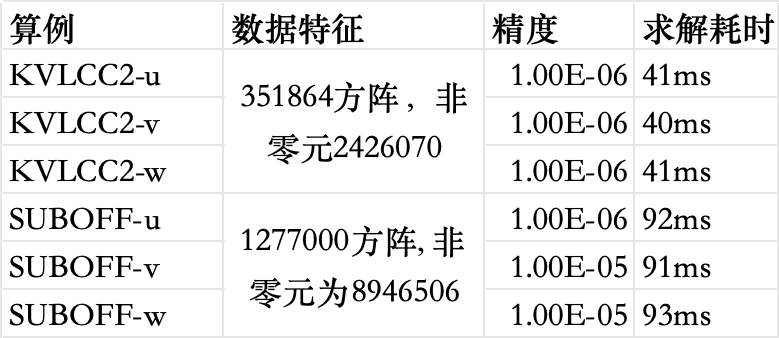

## 基于GPU加速的高性能ILU(0)-PBICGSTAB方法求解大规模线性代数方程组

## 算法优势

基于预处理稳定双共轭梯度法，使用基于依赖分析的不完全LU分解作为预条件求解L-U矩阵，并依次迭代求解。
整体框架基于C/CPP实现，结合C—CUDA编程，本系统在各个关键算法瓶颈点，均进行自研实现，完全使用底层语言优化性能，
最终在三角矩阵求解、LU分解等关键算法计算性能上，超出业界普遍水平10-20倍，如L型三角稀疏矩阵求解性能，是NVIDIA官方CUDA-TOOLKIT-cusparse方法的50倍左右（限定在本次赛题场景）

## 性能评估

GPU  1块 A4000， 16 GB 显存
CPU  6核 E5-2680 v4
内存  32  GB

## 运行说明

* mkdir build && cd build
* cmake ../
* make
* ./megasolve [矩阵行数] [非零元数] [矩阵文件] [右端项文件] [输出结果文件]

## 作品申报书等材料

[作品申报书](作品申报书.docx)

[项目介绍PPT](项目介绍PPT.pptx)

 

